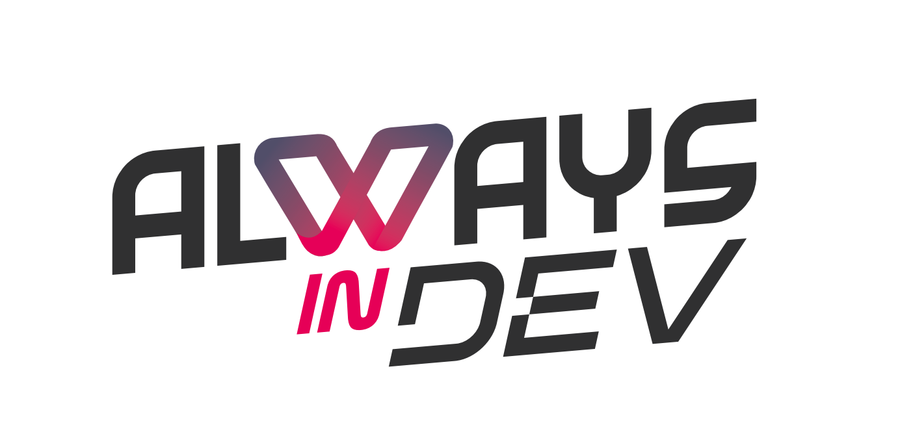
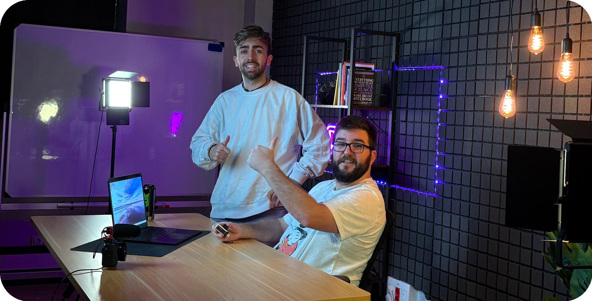

<h1 align="center">
  
  
</h1>

Somos **Alejandro Cárabe (Alex)** y **David Amorín (Dam)**, creadores de **AlwaysInDev**, donde compartimos contenidos de **Inteligencia Artificial, Data Science, Programación e Innovación** y todo lo que nos apasiona.  

<h2 align="center"> 📺 Últimos vídeos de YouTube </h2>

  &nbsp;&nbsp;&nbsp;&nbsp;&nbsp;&nbsp;&nbsp;&nbsp;&nbsp;&nbsp;&nbsp;&nbsp;
  &nbsp;&nbsp;&nbsp;&nbsp;&nbsp;&nbsp;&nbsp;&nbsp;&nbsp;&nbsp;&nbsp;&nbsp;
  

<h2 align="center"> 🌍 Conócenos en nuestras redes </h2>

  &nbsp;&nbsp;&nbsp;&nbsp;&nbsp;&nbsp;&nbsp;&nbsp;&nbsp;&nbsp;&nbsp;&nbsp;
  &nbsp;&nbsp;&nbsp;&nbsp;&nbsp;&nbsp;&nbsp;&nbsp;&nbsp;&nbsp;&nbsp;&nbsp;
  &nbsp;&nbsp;&nbsp;&nbsp;&nbsp;&nbsp;&nbsp;&nbsp;&nbsp;&nbsp;&nbsp;&nbsp;
  

