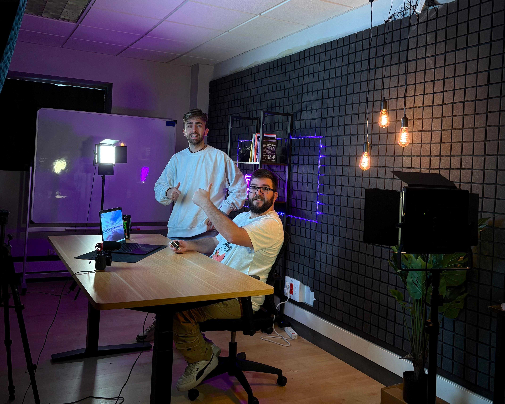

<h1 align="center">Always in Dev 🚀</h1>

  <!-- Logotipo y foto héroe -->
  
   
  

  Somos <b>Alejandro Cárabe (Alex)</b> y <b>David Amorín (Dam)</b>, creadores de <b>AlwaysInDev</b>, donde compartimos contenidos de
  <b>Inteligencia Artificial</b>, <b>Data Science</b>, <b>Programación</b> e <b>Innovación</b>.

<h2 align="center">🌍 Conócenos en nuestras redes</h2>

  
  
  
  

<h2 align="center">📺 Últimos vídeos de YouTube</h2>

  <!-- Usa maxresdefault; si no carga, cambia a hqdefault -->
  
  
  

✨ <i>Siempre en desarrollo. AlwaysInDev.</i> ✨

